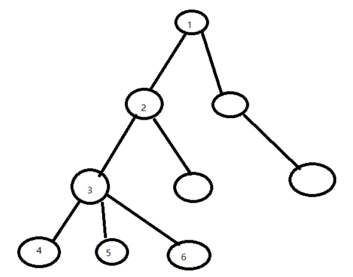

# Leetcode 题解思路总结

### Lc04 寻找两个正序数组的中位数

给定两个大小分别为 m 和 n 的正序（从小到大）数组 nums1 和 nums2。请你找出并返回这两个正序数组的 中位数 。 中位数问题可以转化成找第k大的数。

因为中位数的位置是固定的，等于m+n+1>>1；这里加1是因为当m+n是奇数时，中位数会比二分位多一位，比如5的中位数是3而不是2，加1对偶数不会有影响。

由于在合并后的数组中位置固定，可以预料的是，合并后中位数左边的数有k个并且都有序。即找到合并后数组的第k个数字。但是先合并后找复杂度过高，需要直接在原数组上找出第k个数据。

由于两个数组有序，我们可以在两个数组上分别化一道边界，使得边界左边的数都是合并后数组的前k个数字里的值。如图，合并后数组的AB段别来自与原数组的前半段。

找到这两个边界的条件是，边界左边的数据个数等于k且左边任一数据都比右边小。转换成条件，我们可以先固定元素个数k，将两个指针离0位置的长度和固定为k就可以；然后要保证左边的数据比右边小，即不能存在右边的数据比边界元素还小的情况，如果存在就需要移动边界。

为了不让边界一直左右反复调整，我们可以让长数组上的边界最大，比如k个元素都放在长数组上，然后逐渐缩短长数组的边界，增加短数组的边界，这样调整的顺序是固定的。


### Lc11 盛最多水的容器


典型的双指针法题目。

盛水的多少取决于两块板的高度和中间的距离，这种取决于多个因素取最值的问题，可以采用先固定一个因素，逐步修改其他因素的思想。

如此题中先确定两块板的距离，首先采用最远距离的两块板，计算出盛水容量，然后变动某一块板的高度观察是否能取得更多的盛水量。盛水的高度取决于短的一块板，所以移动短的一块板。如果移动一步并没有使容量增大，则继续移动短的一块。直到找到更大的。

在此步骤中，由于要移动左右两块板，双指针法显然是最合适的。

### Lc15 三数之和

判断是否有三个数和等于目标数。

与Lc11的思路一样，三个加数相当于三个变量，我们需要固定其中一个，变动剩余两个来寻找最合适的结果。这种剩余两个变量的情况一般都采用双指针。在指针移动时必须能够确定移动后的结果比当前结果更靠近目标还是更远离目标，在这里乱序的数组并不能保证，所以需要先排序。

具体的实现思路是：排序后，先固定一个数A，在后续的数据中用双指针法寻找两个数，使得两数相加等于target-A；

由于原始数据是可能有重复值的，又不允许重复三元组，所以去重是关键点。

去重一般会想到HashMap，但最好是能在逻辑中去除相同的结果，这样会省去很多查询结束后的处理过程。

在本题的查询过程中，重复结果都是由重复数据引起的，所以在双指针遍历过程中，左右指针都不访问相同的元素就可以做到去重。因为先进行了排序，重复的数据都排在一起，所以实现还是比较方便的。

### Lc16 最接近的三数之和

找出与目标值最接近的三个数之和

跟Lc15的题目很像，思路也是类似，仍然是固定一个数，双指针查找另外两个数，这里是找最接近的和，所以要在遍历过程中加入查找max的逻辑。因为只要返回和，就不需要去重操作了。

### Lc19 删除链表的倒数第 N 个结点

快慢指针法。让一个指针先走N步，当快指针到达末尾时，慢指针正好指向倒数第n+1个节点，即可删除。

注意特殊情况，如只有一个节点、删除头节点等

### Lc22 括号生成

生成n对括号，输出所有可能的组合。

这种全排列问题通过回溯剪枝法都可以解决。

回溯法最好是用递归去写，简洁方便，迭代比较复杂。

剪枝的条件比较明显，当结果中右括号的数量比左括号还多时，说明当前的结果中出现了没有对应左括号的右括号，就可以不用往下找了。

递归的终止条件是左右括号数量都用完了。

### Lc22 两两交换链表中的节点

观察交换两个节点的过程会发现，交换过程中会影响三个节点，这两个节点和前一个节点，而链表的第一个节点没有前节点，可以加入一个pre节点指向head。

这样在交换过程中形式统一。

可以采用迭代或者递归的形式，每次交换完成后，pre指针向后移动两次，正好指向后面要交换的两个节点的前一节点。

### Lc29 两数相除

模拟整数除法，数据范围[-2^31,2^31-1]，如果结果溢出返回2^31-1。不能使用乘法。

因为无法使用乘法，想快速累积被除数的倍数只能通过左移<<，相当于乘以2^n。

举例：

25除以4:

25=16+8+1=4\*4+4\*2+1=4<<2 + 4<<1 + 1

即25/4的结果等于2^2+2^1=4+2=6

在实现的过程中，该流程表现为25-(4<<i++); 其中i从0开始不断增加，

关于溢出的处理：

+ 在计算之前要对-1，1，0等做特殊处理
+ 由于负数的范围是[-2^31,0]比正数要大，所以可以全部转换成负数来算，等计算出结果再计算正负。
+ 在计算过程中，由于存在对除数的左移，是有可能存在溢出情况的，需要判断左移是否会溢出。判断的方法是，把Integer.MIN_VALUE右移相同位数，看看当前值是不是比这个值还小，如果更小再左移就会溢出了。
+ 当左移后的数据比当前结果还要大时（全换成负数时是更小），说明已经除完了。此时如果左移的结果溢出，应该用Integer.MIN_VAULE来替换。

### Lc33 搜索旋转排序数组

旋转数组是把有序数组的头部一段数组移动拼接到尾部。要求O(logn)

从时间复杂度看很明显要用二分。

有序并不是二分的必要条件，二分的本质是找到目标的确切范围，如果能够确定在某种情况下目标一定在某一个范围内，且不在这种情况下目标一定不在该范围内，就可以用这个逻辑作为二分的条件。二分的关键就是找到这种条件。

比如在此题中，可以通过mid与数组首个数字的对比判断mid落在前半部分还是后半部分。缩小一次范围的情况下，如果mid落在前半部分，如果x也落在前半部分而且比mid要小，说明x一定在start和mid中间，这样就形成了一个二分条件。同理如果mid落在后半部分，x也落在后半部分且比mid要大，x一定在mid和end中间，也形成了一个二分条件。

关于模板：

```
// 模板1
int mid = l+r>>1;
if(check()){
	l=mid+1;
}else r=mid;

// 模板2
int mid = l+r+1>>1;
if(check()){
	l=mid;
}else r=mid-1;
```

模板1用于当mid满足check条件目标不可能等于mid的情况，模板2适用于mid满足check条件时目标可能等于mid的情况

在此题中，由于需要精确找到目标，我们可以直接在循环中判断target == mid的情况直接返回。

关于while(l<r) 还是 while(l<=r)：

后者在l==r时还会执行一次，跳出后l>r，而前者在相等时直接跳出，跳出后l==r，需要在循环外部得出结果。

### Lc34 在排序数组中查找元素的第一个和最后一个位置

二分问题。与Lc33相似，需要找出目标的范围，使得目标在某种情况下一定在该范围内，不在某种情况下一定不在该范围内。

此题中，如果有数组[0,1,2,2,3,3,4]，我们要找2的第一个位置，当mid小于2时，x一定不在mid的左边，而当mid大于等于2时，x一定在mid右边或等于mid。

所以有

~~~
int mid = l+r>>1;
if(mid<target) l=mid+1;
else r=mid;
~~~

而找最后一个2的位置时，当mid大于2时，x一定不在mid的右边，且当mid小于等于2时，x一定在mid左边或等于mid；

所以有

~~~
int mid = l+r+1>1;
if(mid>target) r=mid-1;
else l=mid;
~~~

### Lc38 外观数组

遍历统计即可

### Lc39 组合总和

给定一个无重复元素的数组 candidates 和一个目标数 target ，找出 candidates 中所有可以使数字和为 target 的组合。

组合问题，第一时间想到回溯剪枝。

关于剪枝条件：

排序好后，如果target-num[i]<0，后续的循环也一定小于0，因为后续的num[i]更大，所以可以直接结束本次循环。

关键问题还是去重：

在无重复数组中，还是会出现重复元组的问题，是因为每次dfs都是遍历全部的元素，所以会出现访问已经访问过的元素的情况。

实际上当一个元素被访问完后，到下一个元素的dfs中再去访问这个元素，这个组合是已经被探查过的，不应该再次被访问。

所以可以设置一个循环起始点，当新的dfs开启时，只能从当前访问的元素开始，新的dfs也可以访问当前用到的元素，即允许多次重复使用一个元素，但不能再去访问历史的元素。

### Lc40 组合总和2

与Lc39不同的是，数组会有重复元素，去重的难度增加了。而且不能重复使用同一数字。

处理方式还是与Lc39类似，但由于不能重复使用同一数字，所以循环起始点不能从当前访问的元素开始了。

由于数组会有重复元素，需要加入新的去重条件。

去重的原理其实跟lc39的循环起始点类似。两个相同的元素，第一个元素遍历完成后，所有与第一个元素有关的方案都被试过了，第二个元素与第一个元素相同，产生的方案也是相同的，所以就没必要再遍历一次，直接跳过即可。

所以有：

~~~
if(i>begin&&nums[i]==nums[i-1]) continue;
~~~

### Lc43 字符串相乘

思路是模拟竖式乘法。

~~~
            123
            456
            ----
            6 12 18
         5 10 15
      4 10 12
  =
~~~

从后往前计算出乘积，计算出进位加到前一位。

两数相乘的最大位数是m+n。

计算出的结果前面可能存在多个0，需要去除。

### Lc45 跳跃游戏2*

贪心算法。

在i位置时，能跳到nums[i]+i，则看看从i到nums[i]+i中间有没有可以跳到更远的方法，即next+nums[next]更大，如果有就跳到新的位置。做一次这种选择就跳一步，最终跳到末尾。

### Lc46 全排列

无重复数据。

回溯剪枝即可，剪枝条件是当前搜索中已经用到的数据不能再访问

### Lc47 全排列2

在Lc46的基础上，增加了重复元素，所以对去重有了更高的要求。

关于两种去重方式：

思路1：存在两个相同的元素，以第一个元素开始的排列都遍历过之后，以第二个元素开始的排列与第一个元素完全相同，所以无需重复。

~~~
// 当第一个元素遍历完成后，会将第一个元素的访问标记恢复零
if (i > 0 && nums[i - 1] == nums[i] && flags[i - 1] == 0) continue;
~~~

思路2：存在两个相同元素，以第一个元素开始的排列启动搜索后，如果遇到第二个元素，就跳过，等到后面以第二个元素开始的排列搜索时，遇到第一个元素再加入。本质上是选定了一种顺序，就是两个元素都有的结果中，只计算以第二个元素开头的那个结果。

~~~
// 当遍历第一个元素时，遇到第二个元素跳过，反过来则不会跳过
if (i > 0 && nums[i - 1] == nums[i] && flags[i - 1] == 1) continue;
~~~

### Lc48 旋转图像

旋转矩阵90度等于上下翻转后转置

旋转180度等于上下翻转后左右翻转

旋转270度等于转置后上下翻转

### Lc49 字母异位词分组

异位词就是相同字符组成的不同词，如eat和ate。由于要分组，需要确定不同此词的相同点才可找出分组逻辑。由于异位词的字符和字符个数是相同的，排序之后的字符串也就相同了。分组可以使用hashmap很方便地分。

使用hashmap的getOrDefault方法可以快速判断是否存在并在不存在时获取一个list。

### Lc50 Power

即x^n，在实现中要想节省时间，需要减少计算量，计算次数的减少依赖于计算结果的复用。x\*x..x与 先计算x\*x=A,再用A\*A\*...A 计算结果，两者的计算次数是不一样的。

思路举例：把x^n划分成多个x的平方相乘。如把2^6变成2\*2 \* 2\*2 \* 2\*2 =4\*4\*4=4^3，这样相当于复用了2\*2的计算结果。4^3又可以变成4*4 *4 = 4^2\*4=16\*4 ;

实现的思路：

关键在于n的划分。6可以划分成3个2，即复用2*2的结果，使结果变成4^3，而3又可以划分成1个2和1个1，即使结果变成4^2 \* 4。所以流程是把n/2和余数n%2分别取出来，看看能分成多少个x的平方，再用平方的结果去计算pow(
x\*x,n/2)。

负数与溢出的问题。该逻辑只能处理正数n，如果n为负数，需要变成1/(x^-n)，但n是int类型，负数范围比正数大，直接转正数会溢出，要用n=-1*(long)n

### Lc53 最大子序和

找到整数数组中有最大子序和的连续子数组，返回最大子序和。

一般找这种子数组、子串最值的问题都可以想想动态规划。思考能否使用动态规划的关键是，能否复用前面的结果。

本题中，定义以i为结尾的最大子序和f[i]，和以i-1为结尾的最大子序和f[i-1]，如果f[i-1]大于0，则f[i]可以加上f[i-1]，让自己变得更大。如果f[i-1]小于0，则没有必要加了。

问题是，以i结尾的子串这个定义是如何想出来的，思考这个问题对后续相似的情况会有所帮助。

这种定义是对下标i定义的延申，即想明白i是什么，就知道f[i]
定义是什么。在本题中，连续子数组是我们所求最值属性的主体，这个主体的属性除了数值和以外，还有长度和首尾下标。通常不会以长度作为i的定义，因为长度很难遍历，而i是需要用作遍历的，以长度定义i通常会出现在不确定起始遍历位置的场景中。所以本题中i就作为首或者尾的下标，一般都会用尾下标作为定义，因为这样可以限制当前遍历的数据范围。

可以写出状态转移方程：if(f[i-1]>0) f[i]=f[i-1]+nums[i]  else f[i]=nums[i];

### Lc54 螺旋矩阵

顺时针输出矩阵元素


思路上并不是非常复杂，但实现上需要一些帮助减少特殊边界条件的设计。

由于遍历时上下左右的范围是在变小的，如果能记录上下左右的范围，遍历一个边界就更新一下边界值，就可以在for循环中放心地移动指针。

比如遍历了1->2->3，就把上边界+1，等下次遍历上边界时，就可以从第二行开始遍历。

这种边界逐渐变化的问题，应该在某些条件完成后立刻调整边界，如果等下一次使用到这个边界时再去计算边界值就会比较复杂，甚至会因为条件变化计算不出来。

### Lc55 跳跃游戏

判断能否跳到最后一个。

思路与跳跃游戏2一致，选择能跳得最远的下一步，直到跳出循环，如果还没到达末尾就无法到达。

关键在如何选择下一步。从i能跳到i+nums[i]，如果在i和nums[i]+i之间，还有其他点可以跳得更远，就选择这个更远的点。这样能选择出从i开始跳得最远的方法。

### Lc56 合并区间

合并目标区间数组中重合的区间。

```
[[1,4],[4,5]]=> [1,5]
```

首先为了合并方便，有序是必须的，需要按照区间左边界排序。然后从头开始遍历，如果遇到一个区间的右边界比后面多个区间的左边界大或者相等，就可以合并这些区间，取其中最大的右边界。

这个逻辑中，因为是向后查询可合并的区间，如果最后一个区间不可合并，将不会被遍历到，需要在外部特殊考虑。

关于List<int[]> 转 int\[\]\[\]:

~~~
res.toArray(new int[0][]);
~~~

### Lc57 插入区间

在多个无重叠区间内插入一个新的区间，使得新生成的区间互不干扰

插入一个区间要知道插入区间的左边界和右边界分别落在区间数组的哪些位置，即确定新区间影响的范围。

这样可以把原区间分为三段，第一段是新区间不影响的范围，第二段是新区间影响的范围，第三段也是不影响的范围。

第一段只要保证新区间的左边界比他们右边界还大即可。

找完第一段后面就是第二段的起始，问题是找到结束位置，当新区间的右边界小于等于某个区间的左边界时，说明新区间不会影响这个区间了，前面的就是受影响的位置。

第三段就是剩下的。

在第二段中，由于都是受新区间影响的，都会连成一片，所以只要用里面最大的右边界和最小的左边界生成区间就行。

### Lc59 螺旋矩阵2

给你一个正整数 n ，生成一个包含 1 到 n2 所有元素，且元素按顺时针顺序螺旋排列的 n x n 正方形矩阵 matrix

相当于螺旋矩阵1的反过程。同样的需要不断更改各个边界来减少边界值问题。

### Lc61 旋转链表

给你一个链表的头节点 head，旋转链表，将链表每个节点向右移动 k 个位置。

快慢指针法，快指针从head开始先走k步，再慢指针启动与快指针一同移动，直到快指针到达末尾，此时慢指针应该指向倒数第k+1个（因为是从head开始的，起始就是1），正好慢指针后面的节点数是k，也就是我们要移动的节点数，从慢指针位置操作后续链表移动到head前面即可。

### Lc71 简化路径

给你一个字符串 path ，表示指向某一文件或目录的 Unix 风格 绝对路径。"."表示自身，“..”表示父节点，”...“表示文件名，”//" = “/"。最后一个目录名（如果存在）不能 以 '/' 结尾。

在条件中发现有..表示父节点的情况，相当于要把之前存的结果删除，这是一个栈的操作，但输出又需要先进先出，所以可以用双端队列来实现。

首先可以用split把path分割成字符串，这样通过比对字符串就可以判断当前遇到的是什么情况，而不需要通过char来匹配。

如果遇到..就将双端队列的最后一个结果删除，对应双端队列的pollLast，如果遇到.和//都跳过，其他则offer，插入队列尾部

在输出时，用poll操作从队首开始输出。

### Lc73 矩阵置零

把矩阵中存在0的行和列全部置0，要求空间复杂度O(1)

在矩阵置零的过程中会遇到的问题是，当前访问的0是转变之后的还是转变之前的，比如上层的某次转换把当前行的某个值变成0了，当遍历到这个值是，如何判断它原本是不是0。

这个问题采用标记法是可以解决的，如果给每个元素都标记是否被转变过，空间复杂度是O(m*n)，不符合要求。

可以简化为给每一行和每一列标记，因为只要一行里有一个是0，整行都会被置零，所以只要标记这行里存不存在0就行。这样的空间复杂度是O(m+n)，不符合要求。

行和列的标记可以放在第一行和第一列，而不需要开辟额外的空间。产生的问题是第一行和第一列的数据被覆盖了，这两行是否有0不知道，需要预先用两个标记来记录。

第一行是否有0可以用第一列的第一个值来判断，所以并不需要对第一行做标记，只需要一个列标记即可。

在置零时需要注意不能把第一行和第一列覆盖掉，可以采用倒着遍历的方式

### Lc74 搜索二维矩阵

矩阵的特点

- 每行中的整数从左到右按升序排列。
- 每行的第一个整数大于前一行的最后一个整数。


可以先在第一列二分查找，找到目标可能在的行，再到行上二分查找目标值。

两次二分查找的目的不太一样，第一次是找小于等于目标的最大值，第二次是找目标值

### Lc75 颜色分类

荷兰国旗问题，将三种颜色按顺序排列在一起。

相当于给由0,1,2三种数字组成的乱序数组排序。

由于数字是固定的三种，完全可以统计每种颜色的数量，然后按顺序生成即可。但这样需要遍历两边，复杂度会差一点，要在一次遍历过程中就实现分类和排序，可以联想生活中排不同颜色棋子的场景。


要把黄棋移动到右边，只要从前往后找到一个黄棋的时候跟最后一个交换，于是得到：


然后再找到一个黄棋与倒数第三个交换：


观察得到，在找到黄棋时，要交换的位置是右边黄棋影响范围的左边界前一个位置。

同理，如果要把蓝棋移动到左边，只需要在找到蓝棋时跟左边蓝棋影响范围的右边界的后一个位置交换即可。

### Lc79 单词搜索

给定一个 m x n 二维字符网格 board 和一个字符串单词 word 。如果 word 存在于网格中，返回 true ；否则，返回 false 。


回溯剪枝。剪枝条件包括是否访问过和是否等于字符串对应字符。

对于上下左右边界，可以统一用一个函数来判断xy是否在边界内，这样代码会更清晰一些。

### Lc77 组合

给定两个整数 n 和 k，返回 1 ... n 中所有可能的 k 个数的组合。

很明显的回溯剪枝。重点在于去重，由于可能存在重复的原因是遍历以当前元素开头的组合使遍历到了之前遍历过的组合，像这类搜索以前搜索过的路径的问题，可以
确定一个顺序来保证不重复，比如遍历第二个元素的时候不往回遍历第一个元素。此时只需要设定一个begin作为下一个深度遍历的起始点即可。

### Lc78 子集

给定两个整数 n 和 k，返回 1 ... n 中所有可能的 k 个数的组合。

与Lc77同样的回溯法，同样的去重逻辑

### Lc80 删除有序数组中的重复项 II.

给你一个有序数组 nums ，请你原地删除重复出现的元素，使每个元素最多出现两次，返回删除后数组的新长度。要求空间复杂度O(1)。

要保留两个重复元素，则剩余的重复元素可以跳过，这样就需要给nums维护一个结果指针，指向下一个结果要插入的位置。

整个数组的前两个元素可以保留，后续的元素如果跟当前结果指针-2的位置不相同则插入，否则跳过。因为与当前结果指针-2的位置不相同有两种情况：

1. [1,1,2,2,3] 3的位置，与2不同，说明应该处插入

2. [1,1,2,3] 3的位置，与1不同，说明应该插入

第一种情况符合常理，第二种情况只有在有序的情况下才可以实现，因为3不是与最后结果数组的最后一个结果相异，而是与前面的一个数相异，只有在有序的情况下， 才能保证与前一个数有差异时，等同于与最后一个数有差异。

### Lc81 搜索旋转数组2

数组中会有重复数据。返会是否存在目标值

重复数据对二分搜索的影响是，当mid落在start上，且start值在首位都有的时候，没办法判断哪部分是前，那部分是后。如：

~~~
1 0 1 1 1

如果简单用target<nums[mid]，当mid不等于target的时候，就会一直往左边移动，有可能错过target
~~~

当遇到mid落在start上的情况，由于无法判断该往哪边遍历，只能向前移动start，缩小搜索范围。

注意，二分搜索的范围一直是在变化的，如果需要边界参与条件判断，不能使用nums[0]而是nums[start]。

### Lc82 删除排序链表中的重复元素2.

重复元素节点需要去除

选出不重复的元素拼接进链表即可。选取的方法可以用统计法，也可以直接跳过重复的元素。

### Lc86 分隔链表

给一个x，使得小于x的都在链表左边，大于等于x的都在右边，并且两个区域内的节点保持原本的相对位置。

两个指针各自标注，找到小于x的连接到一个指针，大于等于x的连接到另一个指针。然后将两个链表拼接起来。 需要注意小于x的指针可能为空，此时用另一个指针替代。

### Lc89 格雷编码

保证相邻数据只有一个bit位不同

镜像映射算法。来自格雷码特性的规律总结。即将位数为n-1的格雷码倒序并在首位补1，添加到位数为n-1的格雷码队列中，就得到位数为n的格雷码。

如：

~~~
位数为2的：
00
01
11
10

位数为3的：
000
001
011
010
110
111
101
100
~~~

关于给数字首位补1：假如当前数字x的位数是n，则给x首位补1的思路是将1左移n-1位，并与x求或。

~~~
x= 5

(x)2 = 101

首位补1：

1 左移3位> 1000

与x求或：101 ^ 1000=1101
~~~

### Lc90 子集2.

给一个整数数组，可能存在重复数据，返回无重复结果的全部子集。

回溯剪枝法。需要注意dfs返回的条件可以不写，只要进入就可以添加到结果中，因为从搜索过程来看，同一层的搜索结果只会在进入dfs的时候添加一次，这次 结果就是当前的子集。



如上图，当搜索节点3时，进入该层的dfs，添加结果123到res中。在遍历其子节点时，不会再将123存入结果。

### Lc91 解码方法。

A->1,B->2,... Z->26,将按照该方式加密的字符串解密，返回解码方法的总数。

~~~
例子（等于号后面表示方法总数）：
1 =1
1 2 | 12 =2
1 2 7| 12 7| =2
1 2 7 2|12 7 2| =2
1 2 7 2 0|12 7 2 0| 12 7 20| = 1

1 1|11=2
1 1 2，11 2，1 12=3 = f[i-2]*2
1 1 2 4|11 2 4|1 12 4| 1 1 24| 11 24=5=f[i-2]+f[i-1]
1 1 2 1 2| 11 2 1 2| 1 12 1 2| 1 1 21 2|11 21 2| 1 1 2 12| 11 2 12|1 12 12| = 7 =f[i-2]+f[i-1]

~~~

从上述过程可以总结出规律，即当前的解码方法总数与能够用更短的字符串加密方法数计算出来，所以采用动态规划的方式。

状态转移方程可以总结出来

~~~
如果s[i]能拼接上并与末尾的数组合成有效值：f[i]=f[i-2]+f[i-1]；
否则：f[i]=f[i-1]

需要特殊讨论值为0的情况，由于不能单独存在，如果能与前一数据拼凑成结果，就需要把f[i-1]的值给剪掉，否则值应该是0。
如12706，70是不能组成有效值的，而0又不能单独存在，所以到这里就无法译码了。

在实现的过程中可以先考虑实现状态转移方程，再考虑当前值是否为0，如果为0再减掉f[i-1]即可，因为加上0使得之前的f[i-1]都无法译码了。
而无法与前一值组成有效值时，该数字无法添加新的方案，所以f[i]=f[i-1]，再因为0值无法独立存在，需要减去f[i-1]，就变成0了。
~~~

### Lc92 反转链表2

给定left<=right，翻转从第left个到第right个的链表.

由于在遍历到left之前和之后是完全不同的处理逻辑，可以先用循环遍历到left位置。再重开一个while循环继续后面的循环步骤，但处理逻辑不同。 这样将遍历到left前后的逻辑分开，会清晰一些。

关于反转链表：

反转链表需要做三件事，以1->2->3->4->5，翻转2到4位置的链表举例：

首先要从2开始将3指向2，将4指向3，形成1->2<-3<-4 5。

再将1指向4. 1->4->3->2 5

再将2与5连接起来。 1->4->3->2->5

所以参与反转过程的总共有三部分：需要反转的链表部分，反转链表的前一节点（示例中的1），反转链表的后一节点（示例中的5）。

在遍历的过程中，我们需要第二、三部分记录下来。并且如果反转涉及到第一个节点会导致没有第二部分的节点（因为是第一个），为了不特殊讨论这种情况， 可以给链表预先加一个头节点，让它变成有头链表。

### Lc93 复原 IP 地址

给定一个只包含数字的字符串，用以表示一个 IP 地址，返回所有可能从 s 获得的 有效 IP 地址 。你可以按任何顺序返回答案。

题意所说的所有ip，不是说取其中子集组成ip，而是用所有的字符组成ip，并返回合法的ip。

涉及到组合，就可以试一试回溯剪枝。相当于是dfs找ip的每一段地址是什么，每一段可能的长度有1、2、3种，分别判断是否符合条件。

需要注意的是，剪枝条件中需要对后续数据能否构成ip的判断，当使用了某种长度的字符作为当前段的值时，后续的字符不应该无法构成ip。 而剩余的字符过长或者过短都无法构成ip。

### Lc95 不同二叉搜索树 2

给你一个整数 n ，请你生成并返回所有由 n 个节点组成且节点值从 1 到 n 互不相同的不同 二叉搜索树 。

首先由于返回的是List\<TreeNode\>，只返回root节点，说明必须要创建不同的树。

一棵树由左右两个子树组成，如果把左子树的各种形状和右子树的各种形状组合起来，就能组成这棵树的所有形状。 而子树本身也是由左右两棵树组成，所以是一个分治的场景。

我们看如何划分子问题：在分治的第一层即求1到n的搜索树，我们划分左右子树后，可以得到1~k-1和k+1~n两棵子树。 而下一层，1~k-1中，又需要划分1~p-1,p+1~k-1。所以每一层要解决的问题是如何划分左右子树，即寻找当前子树的根节点。

在此题中只需要遍历当前子树所有节点就可以获取所有可能的根节点了。

划分完子树后，就可以把左右两边生成的各种形状的子树组合拼接起来。即给每一种组合的树生成一个根节点，连接两个子树。

### Lc96 不同的二叉搜索树

给一个整数n，返回所有n个节点组成的不同二叉搜索树的种类数量，节点值从1到n

一棵树的种类数量等于其所有可能的左右子树的种类数量相乘，而这些左右子树的种类数量又与各自可能的子树的种类数量相乘。

比如一棵树有2种划分左右子树的方法，每种划分方法的左右子树可能的形状数量分别是a1、a2,b1、b2种，则这棵树的种类数量有f=a1\*a2+b1\*b2

所以可以用动态规划来解决这个问题。

### Lc97 交错字符串

判断s3是否为s1和s2交错形成。即字符相互交错但保持字符相互顺序.

因为在手动匹配字符串阶段发现字符串相同的时候会有两种不同的匹配方法，所以首先尝试了dfs，当两个字符串都能匹配时，选择两种都试试。

但dfs会有一个问题，有时候会导致复杂度过高。当存在大量可匹配两个字符串的字符时，搜索树会非常深，如“aaaaaa....aaaa"和“aaaaaa....aaaa"的组合，
每一次都会生成一个搜索分支，需要剪枝，目前代码中还没有实现。

另一个方法是动态规划。观察三个字符串，发现如果长度为i和j的字符串是否能交错形成s3，取决于长度为i-1和j的字符串能否形成长度为n的目标字符串，
或者取决于长度为i和j-1的字符串能否形成长度为n-1的目标字符串，如果能形成，且目标字符串最后一个字符是否与i或者j字符串末尾的字符相同。以上条件均
达成即可匹配。
即有如下公式,f[i,j]表示长度为i和j的字符串是否匹配长度为i+j的目标字符串,match(i)表示长度为i的字符串最后一个字符与目标字符串最后一个字符匹配：
~~~
f[i,j]=(f[i-1,j] and match(i)) or (f[i1,j-1] and match(j))
~~~

**关于dp数组的大小**

dp大小是int[s1.length()+1][s2.length()+1]，为什么要加1？是因为从定义上来说，dp表示的是长度为i的字符串和长度为j的字符串是否匹配目标字符串，
而这里的字符串长度是可以为0的；另一个原因是，在公式中，涉及f[i-1,j]的操作，需要用到i-1的数据，从0开始会出现-1的越界下标，而给一个0字符串，
可以预先赋值，然后从1开始遍历。当然也可以从0开始遍历，把预先赋值的操作放在循环中做也是可以的，因为这个操作只有i=0，j>0和j=0,i>0时才能需要判断，
且赋值的依据是dp[i-1][0]或者dp[0][j-1]和字符串末尾是否匹配，跟遍历时的操作其实是一样的。


**关于dp数组的优化**

采用滚动数组对二维空间进行优化，可以只用一维数组来做。原因是只用到了i-1（上一行）和j-1（前一列），观察遍历二维数组的顺序就可以知道，采用一维数组
在更新时，dp[j]就等于原来的dp[i-1][j]。


### Lc98 验证二叉搜索树

判断一棵二叉搜索树是否有效。

中序遍历判断是否严格升序。只要判断当前节点与前一个遍历的节点是否严格升序即可，所以需要记录一个前驱指针。

需要注意的是，这里的前驱指针应该是一个全局的，是记录整个搜索过程中，当前遍历进度的前一个指针。

注意测试用例中有Integer.MIN_VALUE，初始化用于判断严格升序的pre值时需要用Long。或者直接用TreeNode引用，如果引用是空的说明未初始化，
相当于避免了这个问题。

### Lc99 恢复二叉树。

二叉搜索树中两个节点被错误的交换，需要恢复这棵树。

二叉树的问题用中序遍历常常能够解决。特性是中序遍历一定是升序的。在本题中，二叉树的两个节点交换会引起中序遍历不保持升序，问题变成了找到两个节点，
使得交换他们之后中序遍历仍然为升序。如当前的中序遍历顺序是：[3,2,1]，则交换3和1就可以让中序遍历恢复升序。

在中序遍历过程中，第一次找到不升序的节点时，其前驱节点就是交换的第一个节点，而第二个节点应该是小于当前前驱节点的最小值，因为只有交换了最小的值，
才能让后续的节点完全升序，如例子中的3与2交换，是不会在一次交换中让整个中序遍历升序的。


### Lc102 二叉树的层序遍历

BFS，用deque做队列。

如何保证某一层的访问：

每一次BFS都把前一层的所有节点全部出队，如上一层有n个节点，则在遍历下一层时，poll n 次，这样会在一次循环中找遍这一层所有的子节点入队。

~~~
while(!deque.isEmpty()){
    int n=deque.size();
    for(int i=0;i<n;i++){
        deque.offer(...);
    }
}
~~~


### Lc103 二叉树的锯齿形层序遍历

锯齿形层序遍历要求数据在i%2==0的层反向遍历。
比如以下树型：
~~~
[ 2  ]
[ 1 3  ]
[ 4 5 6 7  ]
[ 9 10 11 12 13]
~~~
反向遍历存在的问题是，想通过控制遍历上层节点的顺序和插入队列的顺序直接生成逆序的结果比较难。
如上面的例子，遍历第一层时，先访问2，下一层需要逆序，所以先存入3，再存入1，此时应该从1开始读取，得到子节点4、5，
但要下一层访问的顺序是7、6、5、4. 所以这是一个明显的先进后出顺序，第二层存入的应该是4、5、6、7，而下一层访问时，要切换成栈的方式
访问7、6、5、4。

这种控制比较复杂，我们可以依然按照原来的遍历顺序，只是在访问结束后把需要反向的层结果反向一下。但这种方式引入了反转数组操作，就算用LinkedList
这种适合反转的结构，时间复杂度也较高。

按照反转这个思路，我们可以在插入结果时就进行反转，省去后续的反转操作，如果需要反向就插入到数组首部，形成倒序。
可以看出，这种插入要么在数组首部，要么在数组尾部， 这样我们换成双向链表能达成O(1)的复杂度。


### Lc106 从中序与后序遍历序列构造二叉树

后序遍历的最后一个是根节点，在中序遍历中找到这个数，就可以将中序遍历的结果分成左右两棵树，这两棵树的节点在后序遍历中也是按不同顺序排列在一起的，
所以根据左右子树的节点数，又可以在后序遍历中找到对应的节点，从而找到最后的节点作为根节点，继续在中序遍历中查找后续的子树。

根据这个思路，我们需要根据节点值找到中序遍历对应的索引值，所以可以用一个map把这个对应关系存起来，方便O(1)地查找。

找到中序遍历的索引后，左边的节点都是左子树，要在后序遍历中找左子树的根，可以根据左子树节点数计算，左子树的根在start+len-1的位置。

整个过程变为不断找各个子树的根节点、并用根节点划分左右子树寻找新的根的过程，是一个递归操作。


### Lc107 二叉树的层序遍历II

只是输出的顺序变了而已，结果集换成LinkedList用头插法add(0,x)即可将插入顺序倒过来。

另一种方法是用递归，在一层产生结果以后，先不插入，先去递归计算其他层的结果，直到最后一层返回后再添加到结果集中。
相当于用递归的栈结构来倒置调用递归函数命令后面操作顺序。


### Lc108 将有序数组转换为二叉搜索树

给你一个整数数组 nums ，其中元素已经按 升序 排列，请你将其转换为一棵 高度平衡 二叉搜索树。

即中序遍历还原平衡二叉树，取中间节点为根节点，由于nums可以随机访问，O(1)，直接取出构造根节点，并构造左右子树即可。

如果不可以随机访问，由于顺序遍历数组相当于中序遍历，可以先构建左子树，用一个全局指针顺序遍历，等左子树构造完成，指针也就指向当前根节点了。


### Lc109 有序链表转换二叉树

给定一个单链表，其中的元素按升序排序，将其转换为高度平衡的二叉搜索树。

升序链表，相当于二叉树的中序遍历，所以此题变成从中序遍历还原平衡二叉树。

遍历升序链表的过程就相当于中序遍历的过程，而中序遍历的顺序是左->根->右，所以在递归过程中，先处理左子树，再处理根节点，再处理右子树。

关于左右子树如何分割。由于要保证平衡二叉树，应当采用中位数节点作为根节点，在中序遍历中，一棵子树的节点是在一起的，即在升序数组的一个连续范围内。

~~~
[1,2,3,4,5,6,7,8]

取中位数位置5为根节点，左子树是[1,2,3,4]，右子树是[6,7,8]
先处理左子树，当遍历到1时，处理以1为根节点的子树，遍历到2时，处理以2为根节点的子树，以此类推。
~~~


### Lc111 二叉树的最小深度

中序遍历找到叶子节点。左右两支返回的高度如果有一方是0，说明有一支为null，需要往另一支继续探索。如果两方都不为0，取较小的一方即可。

### Lc120 三角形最小路径和

每个值只能从上一层相邻的两个位置进行访问，求从上到下最短路径

~~~
   2
  3,4
 6,5,7
4,1,8,3
~~~

每一层的最短路径依赖于上一层的最短路径，如[i,j]位置的最短路径依赖于上一层[i-1,j]和[i-1,j+1]两个位置的最短路径。这种重复利用结果，并且可以找出
一定规律的问题，优先使用动态规划解决。

关于dp的定义：

虽然会自然而然地想到自上而下的方式，计算完第i层后才会去计算第i+1层，但这种方式需要考虑很多边界问题，如i=0和i=1需要特殊讨论，j=0和j在末尾也需要特殊
讨论。并且在计算出结果后，还需要统计最后一层中最小的那个值，需要额外的一次遍历。

有的题目可以通过某种方式避免这种边界问题，如本题，从i+1层的角度计算到达i层的路径，必然会产生问题，因为j=0和j=n-1两种情况的处理方法与中间的数据不同。
同一条路径，如果从i层的角度计算到达i+1层的路径，j=0、j=n-1与其他数据的计算方式并无两样。并且能够自动把结果汇总到第0层。

可以更深层次地去讨论问题：为什么从i层计算i+1层的路径，和从i+1层计算i层的路径相差这么大？

先看两层的区别：i层的数量比i+1层小。

所以从i层到i+1层相当于从一个小的集合映射到大的集合，如果这个小的集合到大的集合是满映射关系，我们遍历小的集合时，遍历到的每一个元素都对应着一个映射关系；而如果遍历大的集合则会遍历到无映射关系的元素，就需要做一些判断和讨论。


在这个问题中，i层到i+1层可以视作从i集合到i+1集合的满映射，i层的元素集合的所有元素必然在i+1层集合中有映射的元素，所以当我们遍历i层元素的时候，
每一个元素都有从i到i+1的最短路径。

这个问题带来的意义是，当我们面临两个满映射的集合，并且要遍历映射关系时，最好选择小集合来遍历。

###3 Lc121 买卖股票的最佳时机

给定一个数组 prices ，它的第 i 个元素 prices[i] 表示一支给定股票第 i 天的价格。 你只能选择 某一天 买入这只股票，并选择在 未来的某一个不同的日子 卖出该股票。设计一个算法来计算你所能获取的最大利润。

在暴力解法中，遍历买入点和卖出点的所有可能组合，最终取得最大值，但明显两个变量的遍历组合时间复杂度会很高，在这种多个变量的问题中，
需要通过内在的逻辑来思考在遍历其中一个变量的时候，另一个变量是否可以随之确定下来。

利润与买入价格和卖出价格有关，当遍历卖出价格时，取前面所有可能的买入价格的最低点就是此时卖出的最高利润。所以只需要关注卖出时机就可以。
在遍历卖出价格时，可以通过上一次的卖出价格减去上一次的利润得到上一次的买入价格，如果当前遍历到的卖出价格比上次的买入价格还低，说明上次的买入价格不是最低，
在后面的卖出中应该以这次价格作为买入价格才能利润最高。
然后取每次卖出的最高利润即可。
~~~
关键代码：
pre = Math.max(price[i]-(price[i-1]-pre),0);
当卖出价格比买入价格低，就从这个点重新开始买入，下一次的利润就变成0了。
~~~

明确每个变量的定义并维护好每次遍历这个变量的定义一致性是确保程序执行正确的关键之一。上述pre的定义应该是：前一次卖出的利润。在给pre赋值时，
就应该考虑下一次遍历用到这个值时，这个值的含义是什么？应该也是前一次卖出的利润，即在赋值时这一次的利润。如果这一天不是卖出而是买入，就跟第一天一样，
所以pre的值也跟初始化时一样是0。

###3 Lc122 买卖股票的最佳时机2

给定一个数组 prices ，它的第 i 个元素 prices[i] 表示一支给定股票第 i 天的价格。设计一个算法来计算你所能获取的最大利润。你可以尽可能地完成更多的交易（多次买卖一支股票）。

注意：你不能同时参与多笔交易（你必须在再次购买前出售掉之前的股票）。

关键点与Lc121是一样的，就在于如果某一天遇到的卖出价格比买入价格还低，该如何操作？如果只能买卖一次，那只能挑所有可能的买卖中利润最高的，
所以当遇到低卖出价时之前的利润不能累加，而是算前一天卖出时的利润是不是所有卖出中最大的。如果能买卖多次，在出现更低的买入价格之前，能获得的最大利润应该保留，等出现更低的买入价格后再买入，
争取让买入价格和卖出价格差最大。

### Lc128 最长连续序列

给定一个未排序整数数组，找出最长连续序列，不要求在原数组中连续，如 2 3 1 10 4，结果为[1,2,3,4]。要求时间复杂度O(n).

以每一个元素为起始，判断之后的元素在不在数组里，比如1的后面2不在数组中，说明这个数断档了，如果存在则继续判断3、4等等直到遇到断档的。

由于是乱序的，可能存在2判断完后续的数据，1开始又判断一次，重复，如果选择1作为起始，就可以避免这类问题。所以在想要以某一个数x为起始的时候，预先判断
x-1是不是存在与数组中，即有没有更小的，核心思想是只从连续数组的最小值开始向后查询。

另外判断数据是否存在的最好的方法是使用hashset，能够达到O(1)的效果，所以这里先存入set，再遍历set判断以对应数字为起始的数列是否存在于集合中。

### Lc130 被围绕的区域。

只有被x完全包围的区域才需要替换成x，如果连通区域连接到边界，就不能替换。

只要与四条边联通的O区域就不能被替换成X，所以可以从四条边开始dfs查找这种区域，并标记成其他字符，然后把剩余字符全部替换成X，再把标记的字符替换回O

### Lc131 分割回文串

由于要求返回所有的组合，只能通过回溯来查找。在回溯的过程中需要判断分割出的字符串是否为回文字符串，可以通过动态规划预处理来预先计算出某个子串是否回文。
计算的方法是通过固定某一起始点，向后查找不同长度的子串是否为回文，为了利用前一个长度的子串结果，可以从小到大遍历这个长度。

~~~
判断从i到j的子串是否为回文时，相当于判断从i+1到j-1的子串是否为回文，为了在计算[i,j]之前保证[i+1,j-1]已经计算了，
要按从小到大不同长度依次计算从左到右每个位置的子串，这样在计算[i,j]时，[i+1,j-1]因为长度更小，已经被前一轮计算过了。
~~~

在无法确定起点时，在循环外部遍历长度是一个不错的选择。

### Lc134 加油站。

环形公路上N个加油站，第i个加油站有gas[i]汽油，到下一个加油站的消耗是cost[i]，从哪个加油站开始可以绕环形公路一圈，无则返回-1

在暴力解决的基础上，利用KMP算法的思想：匹配失败得到的信息能够否决某些方案。

否决方案的思路：

如果从某个加油站走到另一个加油站时没有汽油往下走，则这中间经过的所有加油站都不能作为起始点，因为从最开始的加油站到失败点的剩余油料会比从中间任何一个加油站起始到失败点多或者相等，但依然走不完环形，如果从中间开始就更不行了。

~~~
举例：
gas  = [2,1,3,4,5]
cost = [1,1,5,1,2]

如果从第1个加油站开始，初始汽油是2，到第2个加油站消耗1；
第2个加油站补充汽油1，剩余汽油2，到第3个加油站消耗1；
第3个加油站补充汽油3，剩余汽油4，到第4个加油站消耗5，无法到达。
整个过程经过第1、2、3个加油站，最终剩余汽油4。如果从第2、3个加油站开始到第4个加油站前面，则都剩余汽油3升，小于从第一个加油站开始的4升。
~~~

为什么在不成功的路径中经过的加油站里，从第一个加油站开始的路径是剩余汽油是最多的：

因为走到下一个加油站时一定会剩余0升或者更多汽油，否则走不到。则从第一个加油站到无法到达的加油站的这段路上，途径中间任意一个加油站时，起始的汽油量都大于等于从这个中途的加油站开始的量。比如上述例子中，从第二个加油站开始，初始汽油量是1，而从第一个加油站开始途径第二个加油站时，除了这个加油站能补充的汽油，还有上一个加油站剩下的汽油1升，所以此时起始油量是2升。而如果起始2升汽油都无法走完环形路，起始1升汽油更无法走完了。

### Lc137 只出现一次的数字 II

给你一个整数数组nums，除某个元素仅出现一次外，其余每个元素都恰出现三次。请你找出并返回那个只出现了一次的元素。要求时间复杂度O(n)，空间复杂度O(1)

考虑通过map对每个数字出现的次数进行统计，统计完成可以区分出1次和3次的数据，但这种方式不满足空间复杂度O(1)的要求。
如果所有数据都出现3次，则所有数字的每一位bit上的1加起来，一定是3的倍数，此时又来了一个数据，则加起来那些不为3倍数的bit位，一定属于这个1次的数。
自然地想到可以通过遍历数组将所有数据每一bit位的1相加，对3取模，得到是否为3倍数的信息。这样可以用32位数组对每一位的情况做记录，然后将32位合并起来成为目标数字。
但这种方式仍然需要存32个int和后续的合并操作，能否把这个记录每一位情况的操作放在一个int值的bit位上表示呢？

这就需要考虑3的取模结果能否放在一个bit位来表示了，对3的取模结果有3种，而一个bit位只有2种状态，很明显要是放不下的。

3的取模结果为：0、1、2，其中2的结果无法放入一个bit位，因为其二进制是10，跨了两个bit。

分析我们的目标，其实我们只关心0、1这两种情况，这是因为题目中数字出现次数只有3次和1次两种情况，在最终结果里2是不可能出现的，只有遍历中途会出现2次的情况。
所以我们只需要有个地方来帮助记录这个多出来的高位，帮助我们计算就好。每个bit位都可能出现这种情况，所以每个bit位都需要配一个额外的bit来存2这个值的高位，即：
~~~
[1,2,0,1]的结果表示：

额外bit位：[0,1,0,0]
状态bit位：[1,0,0,1]
组成的二进制[01,10,00,01]

~~~

所以最终我们需要一个int来表示最终结果，一个int来存储额外的bit位。

我们可以通过有限状态机和真值表来归纳高位和低位的变化规律。

~~~

当一个bit位上的值是1时，这个位上的1数量对3取模结果变化如下：0->1,1->2,2->0
当一个bit位上的值是0时，这个位上的取模结果不变

我们只需要关心低位的值，因为低位如果最终是1，就说明这一位上的数字多出现了一次，但从真值表上来看，低位的变化也受高位影响，所以高位也需要同时变化

某一位1的个数对3取模的变化真值表，用one表示取模结果的低位，用two表示取模结果的高位

one的变化真值表
n	two0	one0	one1
===========================
0	0	0	0
0	0	1	1
0	1	0	0
1	0	0	1
1	0	1	0
1	1	0	0

two的变化真值表
n	two0	one1	two1
===========================
0	0	0	0
0	0	1	0
0	1	0	1
1	0	1	0
1	0	0	1
1	1	0	0

one计算
two=0:
	n=1: one=~one
	n=0: one=one
two=1:
	one = 0
优化：
two=0:
	one=one^n
two=1:
	one = 0
进一步优化：
one = one^n&~two

two计算
one=0：
	n=0:two=two
	n=1:two=~two
one=1:
	two=0

优化：
one = 0:
	two = two^n
one = 1:
	two = 0
	
进一步优化：
two = two^n&~one

~~~
根据上述的公式计算出最终的低位值，最终低位值的二进制形式为：[0,0,0,0,1,1,0,1]，其中1恰好是出现1次的数字二进制为1的bit位。所以直接返回表示低位的int就可以了。

### Lc139 单词拆分。

给出一个句子和一个字典，判断能否用字典中的单词拆分句子。

明显的高复杂度计算，尝试使用动态规划来解决。

一个长度为i的句子能否被拆分，取决与s[0,j],s[j,i]两个句子是否能被拆分，即长度为j的句子能否被拆分，以及剩下的单词是否在字典里。
所以转移方程式：f[i] = exists: f[j]&&contains(s[j,i]) 其中j in [0,i)

为什么j不能取到i？因为取到i时，[0,j]=[0,i]，相当于用[0,i]求[0,i]。

在判断contains(j,i)的时候，不可避免地需用substring取出[j,i]的字符串，从string底层的实现来看，这个函数是O(n)的复制算法，会消耗额外的空间和时间。

有什么办法可以避免这种复制呢？

相当于换一种判断单词是否在字典中的方法。我们可以遍历字典来判断字典中的某个单词是否在字符串中，并且所在的位置正好在上一次成功判断的下一个字符的位置（指中间没有空隙）。
如果可以不间断地从字典里找到这种单词，最终将拼凑起目标字符串，也就说明这个字符串能够被拆分了。

所以整体的思路可以换成不断地找字典中找出可以拼凑目标字符串的单词。整个过程可以变成一个递归：
遍历字典，判断是否有单词在目标字符串中，并且位于当前字符串的开头。剩下的字符串也按同样的方式查找。

~~~
findStartWord(s,0)
    -> findStartWord(s,offset+word.length)
~~~

在这个递归过程中，可能会存在多个重复的检索，比如字典里有["a","aaa"]，在判断字符串s="aaab"的时候，第一次遍历先会查找a，下一个递归再找a，下一个递归仍然是找a，
此时b不在字典中，查找错误向上层回溯，直到回溯到第一层查找aaa，实际上上一层的遍历过程中，aaa这个答案已经被查找过了，是可以被剪枝掉的。
所以需要在递归的过程中记录下检索的起始字符串（s[0,i]），及时地终止已经判断过的答案。

在递归中使用这种记忆化的技巧来剪枝可以减少大量计算。


### Lc274 H指数

h 代表“高引用次数”（high citations），一名科研人员的 h 指数是指他（她）的 （N 篇论文中）总共有 h 篇论文分别被引用了至少 h 次。
且其余的N - h篇论文每篇被引用次数不超过 h 次。

理解h指数的概念，指有超过h篇论文，被引用次数至少h次。数组中给出的是每篇论文的被引次数，所以按照被引次数排序，
某篇论文自身加上排在后面的论文数量就是被引次数至少h次的数量。

当然还有一个小优化，从后往前遍历能更快。